<h1 align="center">Hi there, I'm Vinayak Parihar 👋</h1>
<h3 align="center">Junior Software Developer | Full-Stack Web & AR/3D Web Enthusiast</h3>

<p align="center">
  
</p>

<p align="center">
  <a href="mailto:vinayakparihar64@gmail.com"></a>
  
  
</p>

---

### 🚀 About Me

- 🎓 B.Sc. Computer Science graduate (2025)
- 💼 Currently working as a **Junior Software Developer** at **DvijSoftware Private Limited**, Nashik
- 🕶️ Previously interned there, building a **3D Augmented Reality web app from scratch**
- 🌱 Currently learning **Android App Development** and **Google Cloud Platform (GCP)**
- 🎯 Interested in scalable full-stack apps, cloud deployment, and immersive AR/3D web experiences
- ⚡ Fun fact: I once built an AR app that lets you place 3D objects in the real world through a browser — no app install needed

---

### 🛠️ Tech Stack

<p align="center">
  
  
  
  
  
</p>

<p align="center">
  
  
  
  
  
</p>

<p align="center">
  
  
  
</p>

<p align="center">
  
  
  
</p>

<p align="center">
  
  
  
  
</p>

---

### 💼 Experience

```text
Junior Software Developer @ DvijSoftware Private Limited          Aug 2025 – Present
├─ Building & maintaining client web apps (PHP, CodeIgniter, MySQL, JS, Bootstrap)
├─ Designing MySQL databases and handling data/application integration
├─ Developing & integrating backend APIs
└─ Debugging, troubleshooting, and requirement analysis with clients

Software Developer Intern @ DvijSoftware Private Limited          Apr 2025 – Jul 2025
├─ Built a 3D AR web app from scratch — React.js, Node.js, Three.js, A-Frame, WebXR
├─ Implemented 3D model loading, positioning, scaling & rotation
└─ Developed camera-based AR for real-world object interaction
```

---

### 📌 Featured Project

**🕶️ AR Web Application** — an in-browser Augmented Reality experience letting users view and interact with 3D models through their device camera, no app install required.
`React.js` · `Node.js` · `Three.js` · `A-Frame` · `WebXR`

> Replace this section with a link to the repo/live demo once it's public: `[Live Demo](#) · [Source](#)`

---

### 📊 GitHub Stats

<p align="center">
  
  
</p>

<p align="center">
  
</p>

> ℹ️ The Stats and Top Languages cards above are generated by a GitHub Action (`.github/workflows/update-readme-cards.yml`) and committed to this repo daily as SVG files — so they always render, with no dependency on a third-party live server. The streak card still points to an external service since it isn't covered by this action.

---

### 📫 Let's Connect

<p align="center">
  <a href="mailto:vinayakparihar64@gmail.com"></a>
  <a href="#"></a>
  <a href="tel:8459946875"></a>
</p>

<p align="center"><i>Based in Nashik, Maharashtra, India 🇮🇳</i></p>
